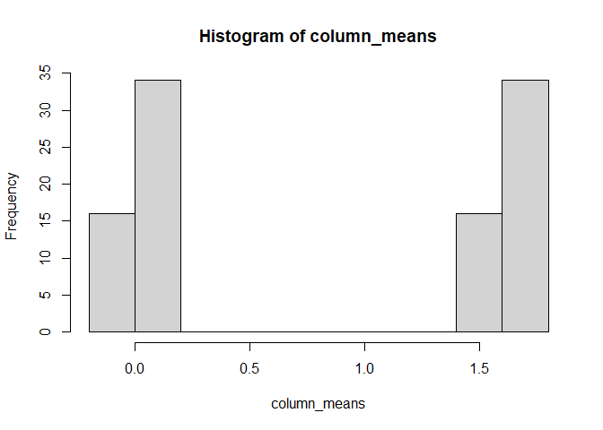

Basics R
================
Mwangi George
2022-10-04

-   <a href="#calculating" id="toc-calculating">Calculating</a>
-   <a href="#assigning-numbers-to-objects"
    id="toc-assigning-numbers-to-objects">Assigning numbers to objects</a>
-   <a href="#working-with-a-single-vector"
    id="toc-working-with-a-single-vector">Working with a single vector</a>
-   <a href="#quoting" id="toc-quoting">Quoting</a>
-   <a href="#working-with-two-vectors"
    id="toc-working-with-two-vectors">Working with two vectors</a>
-   <a href="#working-with-alphabets"
    id="toc-working-with-alphabets">Working with Alphabets</a>
-   <a href="#comparing-and-combining-vectors"
    id="toc-comparing-and-combining-vectors">Comparing and combining
    vectors</a>
-   <a href="#working-with-matrices" id="toc-working-with-matrices">working
    with matrices</a>

### Calculating

1.  The sum of 1203,85385, 8384, and 883

``` r
# using operators
1203 + 85385 +8384 + 883
```

    ## [1] 95855

``` r
# using the sum function
sum(1203,85385, 8384,883)
```

    ## [1] 95855

2.  The square root of 576

``` r
sqrt(576)
```

    ## [1] 24

3.  calculate the 10-based logarithm of 1000, and multiply the result
    with the cosine of pi

``` r
log10(1000)*cos(pi)
```

    ## [1] -3

4.  calculate the cumulative sum of 10,11,12,13,14,15

``` r
cumsum(c(10,11,12,13,14,15))
```

    ## [1] 10 21 33 46 60 75

5.  calculate the cumulative sum of those numbers, but in reverse order.

``` r
cumsum(rev(c(10,11,12,13,14,15)))
```

    ## [1] 15 29 42 54 65 75

6.  Find 5 random numbers between 10 and 50, round to the nearest whole
    number

``` r
# using the runif function
round(runif(5, 10, 50), 0)
```

    ## [1] 38 37 31 38 40

``` r
# using the sample function
sample(10:50, 5)
```

    ## [1] 39 38 24 45 49

### Assigning numbers to objects

Assign 10 to x 30 to y

``` r
x <- 10
y <- 30
```

1.  Calculate the product of x and y

``` r
x*y
```

    ## [1] 300

2.  store the result in a new object called z

``` r
z <- x*y

# print z
z
```

    ## [1] 300

3.  Make a vector of the objects x,y,z

``` r
vector1 <- c(x,y,z)
```

4.  Calculate the minimum, maximum, length, variance, and standard
    deviation of the vector1

``` r
c(min(vector1), max(vector1), length(vector1), var(vector1), sd(vector1))
```

    ## [1]    10.0000   300.0000     3.0000 26233.3333   161.9671

5.  Form a function that performs the above operation

``` r
my.function <- function(x)
{
  return(c(min(x), max(x), length(x), var(x), sd(x)))
}
```

6.  Calculate the minimum, maximum, length, variance, and standard
    deviation of the vector1 using the new function

``` r
my.function(vector1)
```

    ## [1]    10.0000   300.0000     3.0000 26233.3333   161.9671

### Working with a single vector

1.  Store the following numbers into vector called rainfall: 2.1, 2.3,
    1.3, 1.4, 0.1, 1.9, 1.7, 2.0, 1.4, 0.0

``` r
rainfall <- c(2.1, 2.3, 1.3, 1.4, 0.1, 1.9, 1.7, 2.0, 1.4, 0.0)
```

2.  What is the mean rainfall and the standard deviation.

``` r
# mean
mean(rainfall)
```

    ## [1] 1.42

``` r
# standard deviation
sd(rainfall)
```

    ## [1] 0.7927449

``` r
# apply the rainfall vector to my.function and inspect the results
my.function(rainfall)
```

    ## [1]  0.0000000  2.3000000 10.0000000  0.6284444  0.7927449

3.  calculate the cumulative rainfall and cross check the last value
    with sum(rainfall)

``` r
# cumulative sum
cumsum(rainfall)
```

    ##  [1]  2.1  4.4  5.7  7.1  7.2  9.1 10.8 12.8 14.2 14.2

``` r
# sum
sum(rainfall)
```

    ## [1] 14.2

4.  What was the maximum rainfall

``` r
max(rainfall)
```

    ## [1] 2.3

### Quoting

The use of quotes in R

1.  Make two numeric objects

``` r
one <- 1
two <- 2
```

2.  Print a character vector and a numeric vector using the above
    objects U

``` r
vector2 <- c("one", "two")
# print vector2
vector2
```

    ## [1] "one" "two"

``` r
vector3 <- c(one, two)
# print vector3
vector3
```

    ## [1] 1 2

3.  rectify the errors in these codes
    `vector1 <- c('one', 'two', 'three', 'four, 'five', 'seven')`
    `vec.var <- var(c(1, 3, 5, 3, 5, 1)`
    `vec.mean <- mean(c(1, 3, 5, 3, 5, 1)`
    `vec.Min <- Min(c(1, 3, 5, 3, 5, 1))`

``` r
# missing apostrophe after four
vector1 <- c('one', 'two', 'three', 'four', 'five', 'seven')
# missing closing parenthesis
vec.var <- var(c(1, 3, 5, 3, 5, 1))
# missing closing parenthesis
vec.mean <- mean(c(1, 3, 5, 3, 5, 1))
# min () should have lower case 'm'
vec.Min <- min(c(1, 3, 5, 3, 5, 1))
```

### Working with two vectors

I have measured six cups, their lengths are
`2.7, 3.5, 3.8, 2.4, 3.0, 4.9` and their diameters are
`0.6, 0.4, 1.3, 0.8, 0.8, 1.0` 1. Store the data into two vectors

``` r
lengths <- c(2.7, 3.5, 3.8, 2.4, 3.0, 4.9) 
diameters <- c(0.6, 0.4, 1.3, 0.8, 0.8, 1.0)
```

2.  Calculate the correlation between lengths and diameters of the cups

``` r
cor(lengths, diameters)
```

    ## [1] 0.426864

3.  Calculate the volume of each cup

``` r
volumes <- lengths * pi * (diameters/2)^2 
# print volumes
volumes
```

    ## [1] 0.763407 0.439823 5.043827 1.206372 1.507964 3.848451

4.  Create a vector that returns the mean, standard deviation, and
    coefficient of variation of the volumes

``` r
c(mean(volumes),sd(volumes), sd(volumes)/mean(volumes))
```

    ## [1] 2.1349740 1.8658835 0.8739607

5.  Create a function that prints the above output

``` r
volumes.function <- function(x)
{
  return(c(mean(x), 
           sd(x), 
           sd(x)/mean(x)))
}
```

6.  Use the created function to perform task 5 above

``` r
volumes.function(volumes)
```

    ## [1] 2.1349740 1.8658835 0.8739607

7.  Assume your measurements are in centimeters. Recalculate the volumes
    so that their units are in cubic millimeters. Calculate the mean,
    standard deviation, and coefficient of variation of these new
    volumes using the new function.

``` r
# changing units 
volumes.mm <- 10 * lengths * pi * (10 * diameters / 2)^2
# mean, sd and coefficient of variation
volumes.function(volumes.mm)
```

    ## [1] 2134.9740075 1865.8834714    0.8739607

### Working with Alphabets

The letters of the Roman alphabet are conveniently accessible in R via
`letters` and `LETTERS`.

1.  Assign “W”, “X”, “Y” and “Z” into a vector

``` r
lets <- c( "W", "X", "Y", "Z" )
```

2.  Using `rep()` produce patterns

``` r
# replicate each letter 3 times
rep(lets, each =3)
```

    ##  [1] "W" "W" "W" "X" "X" "X" "Y" "Y" "Y" "Z" "Z" "Z"

``` r
# replicate the vector 3 times
rep(lets, times = 3)
```

    ##  [1] "W" "X" "Y" "Z" "W" "X" "Y" "Z" "W" "X" "Y" "Z"

3.  Draw 10 random letters from the lowercase alphabet, and sort them
    alphabetically.

``` r
# print the lower case alphabet
letters
```

    ##  [1] "a" "b" "c" "d" "e" "f" "g" "h" "i" "j" "k" "l" "m" "n" "o" "p" "q" "r" "s"
    ## [20] "t" "u" "v" "w" "x" "y" "z"

``` r
# take a sample of 10 from the letters
sample(letters, 10)
```

    ##  [1] "k" "f" "n" "h" "d" "y" "g" "t" "i" "b"

``` r
# sort the sample alphabetically
sort(sample(letters, 10, replace = T)) # sample with replacement
```

    ##  [1] "a" "f" "j" "k" "l" "o" "o" "s" "u" "v"

4.  Draw 10 random letters from each of the lowercase and uppercase
    alphabets, incorporating both into a single vector, and sort it
    alphabetically.

``` r
# lowercase sample
lower <- sample(letters, 10)
# uppercase sample
upper <- sample(LETTERS, 10)
# combined vector
combined <- c(lower, upper)
# sort the combined vector alphabetically
sort(combined)
```

    ##  [1] "A" "b" "c" "d" "E" "g" "G" "h" "H" "j" "l" "L" "o" "Q" "R" "T" "w" "X" "y"
    ## [20] "Y"

``` r
# Repeat the above in one line of code
sort(c(sample(letters, 10), sample(LETTERS, 10)))
```

    ##  [1] "a" "c" "D" "e" "E" "f" "H" "I" "k" "L" "m" "O" "p" "P" "r" "R" "u" "W" "y"
    ## [20] "Y"

``` r
# Repeat the above but sort the vector alphabetically in descending order
sort(c(sample(letters, 10), sample(LETTERS, 10)), decreasing = T)
```

    ##  [1] "Z" "z" "Y" "y" "W" "v" "u" "Q" "O" "m" "L" "l" "k" "J" "I" "h" "d" "c" "B"
    ## [20] "A"

### Comparing and combining vectors

Functions such as `union`, `setdiff`, and `intersect` can be used to
compare and combine two vectors Make two vectors

``` r
x <- c(1,3,5,6,7,8)
y <- c(8,5,2,3,1,6)
```

1.  Find the values that are contained in both x and y

``` r
intersect(x,y)
```

    ## [1] 1 3 5 6 8

2.  Find the values that are in x but are not in y

``` r
# note the difference between 
setdiff(x,y)
```

    ## [1] 7

3.  Find the values that are in y but are not in x

``` r
setdiff(y,x)
```

    ## [1] 2

4.  Construct a vector that contains all values contained in either x or
    y, and compare this vector to vector c(x,y).

``` r
union(x, y)  # finds values in either x or y
```

    ## [1] 1 3 5 6 7 8 2

``` r
c(x,y) # glues the values together
```

    ##  [1] 1 3 5 6 7 8 8 5 2 3 1 6

### working with matrices

1.  Construct a matrix with 5 columns and 5 rows, all filled with random
    numbers between 0 and 5. assign the matrix to matrix1

``` r
matrix1 <- matrix(rnorm(0:5), byrow = T, ncol = 5, nrow = 5)
```

    ## Warning in matrix(rnorm(0:5), byrow = T, ncol = 5, nrow = 5): data length [6] is
    ## not a sub-multiple or multiple of the number of rows [5]

``` r
# print matrix1
matrix1
```

    ##             [,1]        [,2]       [,3]        [,4]        [,5]
    ## [1,]  1.82037353 -0.22434701 -1.2968654  0.04996274  0.75938533
    ## [2,]  1.69824367  1.82037353 -0.2243470 -1.29686540  0.04996274
    ## [3,]  0.75938533  1.69824367  1.8203735 -0.22434701 -1.29686540
    ## [4,]  0.04996274  0.75938533  1.6982437  1.82037353 -0.22434701
    ## [5,] -1.29686540  0.04996274  0.7593853  1.69824367  1.82037353

2.  Calculate the row means of matrix1

``` r
rowMeans(matrix1)
```

    ## [1] 0.2217018 0.4094735 0.5513580 0.8207237 0.6062200

3.  Calculate the standard deviation across the row means

``` r
sd(rowMeans(matrix1))
```

    ## [1] 0.2236246

4.  Now remake the above matrix with 100 columns, and 10 rows.

``` r
matrix2 <- matrix(rnorm(0:5), byrow = T, ncol = 100, nrow = 10)
```

    ## Warning in matrix(rnorm(0:5), byrow = T, ncol = 100, nrow = 10): data length [6]
    ## is not a sub-multiple or multiple of the number of rows [10]

``` r
# print matrix2 
matrix2
```

    ##           [,1]        [,2]     [,3]        [,4]     [,5]        [,6]     [,7]
    ##  [1,] 1.864956  0.42956345 1.862862  0.05401886 1.078472 -0.36321718 1.864956
    ##  [2,] 1.078472 -0.36321718 1.864956  0.42956345 1.862862  0.05401886 1.078472
    ##  [3,] 1.862862  0.05401886 1.078472 -0.36321718 1.864956  0.42956345 1.862862
    ##  [4,] 1.864956  0.42956345 1.862862  0.05401886 1.078472 -0.36321718 1.864956
    ##  [5,] 1.078472 -0.36321718 1.864956  0.42956345 1.862862  0.05401886 1.078472
    ##  [6,] 1.862862  0.05401886 1.078472 -0.36321718 1.864956  0.42956345 1.862862
    ##  [7,] 1.864956  0.42956345 1.862862  0.05401886 1.078472 -0.36321718 1.864956
    ##  [8,] 1.078472 -0.36321718 1.864956  0.42956345 1.862862  0.05401886 1.078472
    ##  [9,] 1.862862  0.05401886 1.078472 -0.36321718 1.864956  0.42956345 1.862862
    ## [10,] 1.864956  0.42956345 1.862862  0.05401886 1.078472 -0.36321718 1.864956
    ##              [,8]     [,9]       [,10]    [,11]       [,12]    [,13]
    ##  [1,]  0.42956345 1.862862  0.05401886 1.078472 -0.36321718 1.864956
    ##  [2,] -0.36321718 1.864956  0.42956345 1.862862  0.05401886 1.078472
    ##  [3,]  0.05401886 1.078472 -0.36321718 1.864956  0.42956345 1.862862
    ##  [4,]  0.42956345 1.862862  0.05401886 1.078472 -0.36321718 1.864956
    ##  [5,] -0.36321718 1.864956  0.42956345 1.862862  0.05401886 1.078472
    ##  [6,]  0.05401886 1.078472 -0.36321718 1.864956  0.42956345 1.862862
    ##  [7,]  0.42956345 1.862862  0.05401886 1.078472 -0.36321718 1.864956
    ##  [8,] -0.36321718 1.864956  0.42956345 1.862862  0.05401886 1.078472
    ##  [9,]  0.05401886 1.078472 -0.36321718 1.864956  0.42956345 1.862862
    ## [10,]  0.42956345 1.862862  0.05401886 1.078472 -0.36321718 1.864956
    ##             [,14]    [,15]       [,16]    [,17]       [,18]    [,19]
    ##  [1,]  0.42956345 1.862862  0.05401886 1.078472 -0.36321718 1.864956
    ##  [2,] -0.36321718 1.864956  0.42956345 1.862862  0.05401886 1.078472
    ##  [3,]  0.05401886 1.078472 -0.36321718 1.864956  0.42956345 1.862862
    ##  [4,]  0.42956345 1.862862  0.05401886 1.078472 -0.36321718 1.864956
    ##  [5,] -0.36321718 1.864956  0.42956345 1.862862  0.05401886 1.078472
    ##  [6,]  0.05401886 1.078472 -0.36321718 1.864956  0.42956345 1.862862
    ##  [7,]  0.42956345 1.862862  0.05401886 1.078472 -0.36321718 1.864956
    ##  [8,] -0.36321718 1.864956  0.42956345 1.862862  0.05401886 1.078472
    ##  [9,]  0.05401886 1.078472 -0.36321718 1.864956  0.42956345 1.862862
    ## [10,]  0.42956345 1.862862  0.05401886 1.078472 -0.36321718 1.864956
    ##             [,20]    [,21]       [,22]    [,23]       [,24]    [,25]
    ##  [1,]  0.42956345 1.862862  0.05401886 1.078472 -0.36321718 1.864956
    ##  [2,] -0.36321718 1.864956  0.42956345 1.862862  0.05401886 1.078472
    ##  [3,]  0.05401886 1.078472 -0.36321718 1.864956  0.42956345 1.862862
    ##  [4,]  0.42956345 1.862862  0.05401886 1.078472 -0.36321718 1.864956
    ##  [5,] -0.36321718 1.864956  0.42956345 1.862862  0.05401886 1.078472
    ##  [6,]  0.05401886 1.078472 -0.36321718 1.864956  0.42956345 1.862862
    ##  [7,]  0.42956345 1.862862  0.05401886 1.078472 -0.36321718 1.864956
    ##  [8,] -0.36321718 1.864956  0.42956345 1.862862  0.05401886 1.078472
    ##  [9,]  0.05401886 1.078472 -0.36321718 1.864956  0.42956345 1.862862
    ## [10,]  0.42956345 1.862862  0.05401886 1.078472 -0.36321718 1.864956
    ##             [,26]    [,27]       [,28]    [,29]       [,30]    [,31]
    ##  [1,]  0.42956345 1.862862  0.05401886 1.078472 -0.36321718 1.864956
    ##  [2,] -0.36321718 1.864956  0.42956345 1.862862  0.05401886 1.078472
    ##  [3,]  0.05401886 1.078472 -0.36321718 1.864956  0.42956345 1.862862
    ##  [4,]  0.42956345 1.862862  0.05401886 1.078472 -0.36321718 1.864956
    ##  [5,] -0.36321718 1.864956  0.42956345 1.862862  0.05401886 1.078472
    ##  [6,]  0.05401886 1.078472 -0.36321718 1.864956  0.42956345 1.862862
    ##  [7,]  0.42956345 1.862862  0.05401886 1.078472 -0.36321718 1.864956
    ##  [8,] -0.36321718 1.864956  0.42956345 1.862862  0.05401886 1.078472
    ##  [9,]  0.05401886 1.078472 -0.36321718 1.864956  0.42956345 1.862862
    ## [10,]  0.42956345 1.862862  0.05401886 1.078472 -0.36321718 1.864956
    ##             [,32]    [,33]       [,34]    [,35]       [,36]    [,37]
    ##  [1,]  0.42956345 1.862862  0.05401886 1.078472 -0.36321718 1.864956
    ##  [2,] -0.36321718 1.864956  0.42956345 1.862862  0.05401886 1.078472
    ##  [3,]  0.05401886 1.078472 -0.36321718 1.864956  0.42956345 1.862862
    ##  [4,]  0.42956345 1.862862  0.05401886 1.078472 -0.36321718 1.864956
    ##  [5,] -0.36321718 1.864956  0.42956345 1.862862  0.05401886 1.078472
    ##  [6,]  0.05401886 1.078472 -0.36321718 1.864956  0.42956345 1.862862
    ##  [7,]  0.42956345 1.862862  0.05401886 1.078472 -0.36321718 1.864956
    ##  [8,] -0.36321718 1.864956  0.42956345 1.862862  0.05401886 1.078472
    ##  [9,]  0.05401886 1.078472 -0.36321718 1.864956  0.42956345 1.862862
    ## [10,]  0.42956345 1.862862  0.05401886 1.078472 -0.36321718 1.864956
    ##             [,38]    [,39]       [,40]    [,41]       [,42]    [,43]
    ##  [1,]  0.42956345 1.862862  0.05401886 1.078472 -0.36321718 1.864956
    ##  [2,] -0.36321718 1.864956  0.42956345 1.862862  0.05401886 1.078472
    ##  [3,]  0.05401886 1.078472 -0.36321718 1.864956  0.42956345 1.862862
    ##  [4,]  0.42956345 1.862862  0.05401886 1.078472 -0.36321718 1.864956
    ##  [5,] -0.36321718 1.864956  0.42956345 1.862862  0.05401886 1.078472
    ##  [6,]  0.05401886 1.078472 -0.36321718 1.864956  0.42956345 1.862862
    ##  [7,]  0.42956345 1.862862  0.05401886 1.078472 -0.36321718 1.864956
    ##  [8,] -0.36321718 1.864956  0.42956345 1.862862  0.05401886 1.078472
    ##  [9,]  0.05401886 1.078472 -0.36321718 1.864956  0.42956345 1.862862
    ## [10,]  0.42956345 1.862862  0.05401886 1.078472 -0.36321718 1.864956
    ##             [,44]    [,45]       [,46]    [,47]       [,48]    [,49]
    ##  [1,]  0.42956345 1.862862  0.05401886 1.078472 -0.36321718 1.864956
    ##  [2,] -0.36321718 1.864956  0.42956345 1.862862  0.05401886 1.078472
    ##  [3,]  0.05401886 1.078472 -0.36321718 1.864956  0.42956345 1.862862
    ##  [4,]  0.42956345 1.862862  0.05401886 1.078472 -0.36321718 1.864956
    ##  [5,] -0.36321718 1.864956  0.42956345 1.862862  0.05401886 1.078472
    ##  [6,]  0.05401886 1.078472 -0.36321718 1.864956  0.42956345 1.862862
    ##  [7,]  0.42956345 1.862862  0.05401886 1.078472 -0.36321718 1.864956
    ##  [8,] -0.36321718 1.864956  0.42956345 1.862862  0.05401886 1.078472
    ##  [9,]  0.05401886 1.078472 -0.36321718 1.864956  0.42956345 1.862862
    ## [10,]  0.42956345 1.862862  0.05401886 1.078472 -0.36321718 1.864956
    ##             [,50]    [,51]       [,52]    [,53]       [,54]    [,55]
    ##  [1,]  0.42956345 1.862862  0.05401886 1.078472 -0.36321718 1.864956
    ##  [2,] -0.36321718 1.864956  0.42956345 1.862862  0.05401886 1.078472
    ##  [3,]  0.05401886 1.078472 -0.36321718 1.864956  0.42956345 1.862862
    ##  [4,]  0.42956345 1.862862  0.05401886 1.078472 -0.36321718 1.864956
    ##  [5,] -0.36321718 1.864956  0.42956345 1.862862  0.05401886 1.078472
    ##  [6,]  0.05401886 1.078472 -0.36321718 1.864956  0.42956345 1.862862
    ##  [7,]  0.42956345 1.862862  0.05401886 1.078472 -0.36321718 1.864956
    ##  [8,] -0.36321718 1.864956  0.42956345 1.862862  0.05401886 1.078472
    ##  [9,]  0.05401886 1.078472 -0.36321718 1.864956  0.42956345 1.862862
    ## [10,]  0.42956345 1.862862  0.05401886 1.078472 -0.36321718 1.864956
    ##             [,56]    [,57]       [,58]    [,59]       [,60]    [,61]
    ##  [1,]  0.42956345 1.862862  0.05401886 1.078472 -0.36321718 1.864956
    ##  [2,] -0.36321718 1.864956  0.42956345 1.862862  0.05401886 1.078472
    ##  [3,]  0.05401886 1.078472 -0.36321718 1.864956  0.42956345 1.862862
    ##  [4,]  0.42956345 1.862862  0.05401886 1.078472 -0.36321718 1.864956
    ##  [5,] -0.36321718 1.864956  0.42956345 1.862862  0.05401886 1.078472
    ##  [6,]  0.05401886 1.078472 -0.36321718 1.864956  0.42956345 1.862862
    ##  [7,]  0.42956345 1.862862  0.05401886 1.078472 -0.36321718 1.864956
    ##  [8,] -0.36321718 1.864956  0.42956345 1.862862  0.05401886 1.078472
    ##  [9,]  0.05401886 1.078472 -0.36321718 1.864956  0.42956345 1.862862
    ## [10,]  0.42956345 1.862862  0.05401886 1.078472 -0.36321718 1.864956
    ##             [,62]    [,63]       [,64]    [,65]       [,66]    [,67]
    ##  [1,]  0.42956345 1.862862  0.05401886 1.078472 -0.36321718 1.864956
    ##  [2,] -0.36321718 1.864956  0.42956345 1.862862  0.05401886 1.078472
    ##  [3,]  0.05401886 1.078472 -0.36321718 1.864956  0.42956345 1.862862
    ##  [4,]  0.42956345 1.862862  0.05401886 1.078472 -0.36321718 1.864956
    ##  [5,] -0.36321718 1.864956  0.42956345 1.862862  0.05401886 1.078472
    ##  [6,]  0.05401886 1.078472 -0.36321718 1.864956  0.42956345 1.862862
    ##  [7,]  0.42956345 1.862862  0.05401886 1.078472 -0.36321718 1.864956
    ##  [8,] -0.36321718 1.864956  0.42956345 1.862862  0.05401886 1.078472
    ##  [9,]  0.05401886 1.078472 -0.36321718 1.864956  0.42956345 1.862862
    ## [10,]  0.42956345 1.862862  0.05401886 1.078472 -0.36321718 1.864956
    ##             [,68]    [,69]       [,70]    [,71]       [,72]    [,73]
    ##  [1,]  0.42956345 1.862862  0.05401886 1.078472 -0.36321718 1.864956
    ##  [2,] -0.36321718 1.864956  0.42956345 1.862862  0.05401886 1.078472
    ##  [3,]  0.05401886 1.078472 -0.36321718 1.864956  0.42956345 1.862862
    ##  [4,]  0.42956345 1.862862  0.05401886 1.078472 -0.36321718 1.864956
    ##  [5,] -0.36321718 1.864956  0.42956345 1.862862  0.05401886 1.078472
    ##  [6,]  0.05401886 1.078472 -0.36321718 1.864956  0.42956345 1.862862
    ##  [7,]  0.42956345 1.862862  0.05401886 1.078472 -0.36321718 1.864956
    ##  [8,] -0.36321718 1.864956  0.42956345 1.862862  0.05401886 1.078472
    ##  [9,]  0.05401886 1.078472 -0.36321718 1.864956  0.42956345 1.862862
    ## [10,]  0.42956345 1.862862  0.05401886 1.078472 -0.36321718 1.864956
    ##             [,74]    [,75]       [,76]    [,77]       [,78]    [,79]
    ##  [1,]  0.42956345 1.862862  0.05401886 1.078472 -0.36321718 1.864956
    ##  [2,] -0.36321718 1.864956  0.42956345 1.862862  0.05401886 1.078472
    ##  [3,]  0.05401886 1.078472 -0.36321718 1.864956  0.42956345 1.862862
    ##  [4,]  0.42956345 1.862862  0.05401886 1.078472 -0.36321718 1.864956
    ##  [5,] -0.36321718 1.864956  0.42956345 1.862862  0.05401886 1.078472
    ##  [6,]  0.05401886 1.078472 -0.36321718 1.864956  0.42956345 1.862862
    ##  [7,]  0.42956345 1.862862  0.05401886 1.078472 -0.36321718 1.864956
    ##  [8,] -0.36321718 1.864956  0.42956345 1.862862  0.05401886 1.078472
    ##  [9,]  0.05401886 1.078472 -0.36321718 1.864956  0.42956345 1.862862
    ## [10,]  0.42956345 1.862862  0.05401886 1.078472 -0.36321718 1.864956
    ##             [,80]    [,81]       [,82]    [,83]       [,84]    [,85]
    ##  [1,]  0.42956345 1.862862  0.05401886 1.078472 -0.36321718 1.864956
    ##  [2,] -0.36321718 1.864956  0.42956345 1.862862  0.05401886 1.078472
    ##  [3,]  0.05401886 1.078472 -0.36321718 1.864956  0.42956345 1.862862
    ##  [4,]  0.42956345 1.862862  0.05401886 1.078472 -0.36321718 1.864956
    ##  [5,] -0.36321718 1.864956  0.42956345 1.862862  0.05401886 1.078472
    ##  [6,]  0.05401886 1.078472 -0.36321718 1.864956  0.42956345 1.862862
    ##  [7,]  0.42956345 1.862862  0.05401886 1.078472 -0.36321718 1.864956
    ##  [8,] -0.36321718 1.864956  0.42956345 1.862862  0.05401886 1.078472
    ##  [9,]  0.05401886 1.078472 -0.36321718 1.864956  0.42956345 1.862862
    ## [10,]  0.42956345 1.862862  0.05401886 1.078472 -0.36321718 1.864956
    ##             [,86]    [,87]       [,88]    [,89]       [,90]    [,91]
    ##  [1,]  0.42956345 1.862862  0.05401886 1.078472 -0.36321718 1.864956
    ##  [2,] -0.36321718 1.864956  0.42956345 1.862862  0.05401886 1.078472
    ##  [3,]  0.05401886 1.078472 -0.36321718 1.864956  0.42956345 1.862862
    ##  [4,]  0.42956345 1.862862  0.05401886 1.078472 -0.36321718 1.864956
    ##  [5,] -0.36321718 1.864956  0.42956345 1.862862  0.05401886 1.078472
    ##  [6,]  0.05401886 1.078472 -0.36321718 1.864956  0.42956345 1.862862
    ##  [7,]  0.42956345 1.862862  0.05401886 1.078472 -0.36321718 1.864956
    ##  [8,] -0.36321718 1.864956  0.42956345 1.862862  0.05401886 1.078472
    ##  [9,]  0.05401886 1.078472 -0.36321718 1.864956  0.42956345 1.862862
    ## [10,]  0.42956345 1.862862  0.05401886 1.078472 -0.36321718 1.864956
    ##             [,92]    [,93]       [,94]    [,95]       [,96]    [,97]
    ##  [1,]  0.42956345 1.862862  0.05401886 1.078472 -0.36321718 1.864956
    ##  [2,] -0.36321718 1.864956  0.42956345 1.862862  0.05401886 1.078472
    ##  [3,]  0.05401886 1.078472 -0.36321718 1.864956  0.42956345 1.862862
    ##  [4,]  0.42956345 1.862862  0.05401886 1.078472 -0.36321718 1.864956
    ##  [5,] -0.36321718 1.864956  0.42956345 1.862862  0.05401886 1.078472
    ##  [6,]  0.05401886 1.078472 -0.36321718 1.864956  0.42956345 1.862862
    ##  [7,]  0.42956345 1.862862  0.05401886 1.078472 -0.36321718 1.864956
    ##  [8,] -0.36321718 1.864956  0.42956345 1.862862  0.05401886 1.078472
    ##  [9,]  0.05401886 1.078472 -0.36321718 1.864956  0.42956345 1.862862
    ## [10,]  0.42956345 1.862862  0.05401886 1.078472 -0.36321718 1.864956
    ##             [,98]    [,99]      [,100]
    ##  [1,]  0.42956345 1.862862  0.05401886
    ##  [2,] -0.36321718 1.864956  0.42956345
    ##  [3,]  0.05401886 1.078472 -0.36321718
    ##  [4,]  0.42956345 1.862862  0.05401886
    ##  [5,] -0.36321718 1.864956  0.42956345
    ##  [6,]  0.05401886 1.078472 -0.36321718
    ##  [7,]  0.42956345 1.862862  0.05401886
    ##  [8,] -0.36321718 1.864956  0.42956345
    ##  [9,]  0.05401886 1.078472 -0.36321718
    ## [10,]  0.42956345 1.862862  0.05401886

5.  Calculate the column means of matrix2

``` r
column_means <- colMeans(matrix2)
# print column_means 
column_means
```

    ##   [1]  1.6283825002  0.0790658833  1.6281731430  0.0415114236  1.5497341421
    ##   [6] -0.0002121804  1.6283825002  0.0790658833  1.6281731430  0.0415114236
    ##  [11]  1.5497341421 -0.0002121804  1.6283825002  0.0790658833  1.6281731430
    ##  [16]  0.0415114236  1.5497341421 -0.0002121804  1.6283825002  0.0790658833
    ##  [21]  1.6281731430  0.0415114236  1.5497341421 -0.0002121804  1.6283825002
    ##  [26]  0.0790658833  1.6281731430  0.0415114236  1.5497341421 -0.0002121804
    ##  [31]  1.6283825002  0.0790658833  1.6281731430  0.0415114236  1.5497341421
    ##  [36] -0.0002121804  1.6283825002  0.0790658833  1.6281731430  0.0415114236
    ##  [41]  1.5497341421 -0.0002121804  1.6283825002  0.0790658833  1.6281731430
    ##  [46]  0.0415114236  1.5497341421 -0.0002121804  1.6283825002  0.0790658833
    ##  [51]  1.6281731430  0.0415114236  1.5497341421 -0.0002121804  1.6283825002
    ##  [56]  0.0790658833  1.6281731430  0.0415114236  1.5497341421 -0.0002121804
    ##  [61]  1.6283825002  0.0790658833  1.6281731430  0.0415114236  1.5497341421
    ##  [66] -0.0002121804  1.6283825002  0.0790658833  1.6281731430  0.0415114236
    ##  [71]  1.5497341421 -0.0002121804  1.6283825002  0.0790658833  1.6281731430
    ##  [76]  0.0415114236  1.5497341421 -0.0002121804  1.6283825002  0.0790658833
    ##  [81]  1.6281731430  0.0415114236  1.5497341421 -0.0002121804  1.6283825002
    ##  [86]  0.0790658833  1.6281731430  0.0415114236  1.5497341421 -0.0002121804
    ##  [91]  1.6283825002  0.0790658833  1.6281731430  0.0415114236  1.5497341421
    ##  [96] -0.0002121804  1.6283825002  0.0790658833  1.6281731430  0.0415114236

6.  Plot a histogram of the column means of matrix2

``` r
hist(column_means, breaks = 10)
```

<!-- -->
