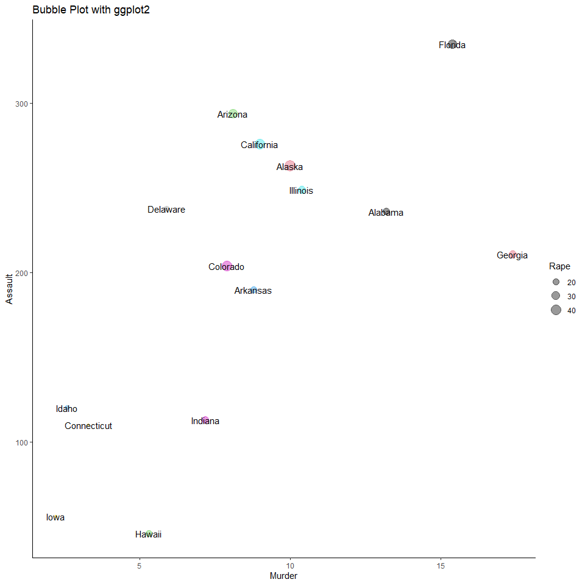

Drawing a Bubble Plot with ggplot
================
Mwangi George
2022-10-15

## Introduction

A scatter plot is an incredible go-to graphic when representing two
numeric variables. However, when we want to add one more numeric
variable to the dimension, one easy way is to use a bubble plot. Let’s
use the Kenyan population data set available in the datasets folder of
this repository.

## Data Exploration

``` r
# loading packages 
pacman::p_load(tidyverse)

# load dataset
data <- USArrests

# Print a few rows
head(data)
```

    ##            Murder Assault UrbanPop Rape
    ## Alabama      13.2     236       58 21.2
    ## Alaska       10.0     263       48 44.5
    ## Arizona       8.1     294       80 31.0
    ## Arkansas      8.8     190       50 19.5
    ## California    9.0     276       91 40.6
    ## Colorado      7.9     204       78 38.7

## Visualization

``` r
data %>% 
  slice_head(n = 15) %>% 
  ggplot(aes(Murder, Assault, size = Rape, label = row.names(.)))+
  geom_point(col = 1:15, alpha = 0.4)+
  geom_text(size =4, position = "identity", check_overlap = T)+
  theme_classic()+
  ggtitle("Bubble Plot with ggplot2")
```

<!-- -->
