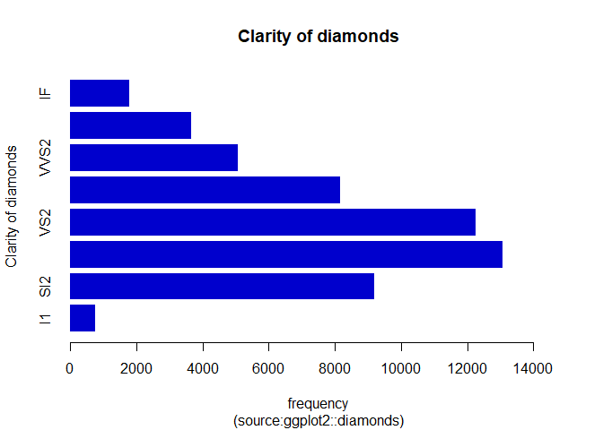
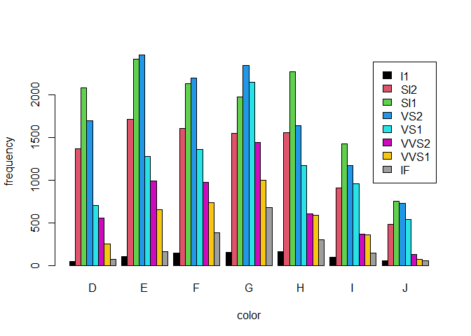
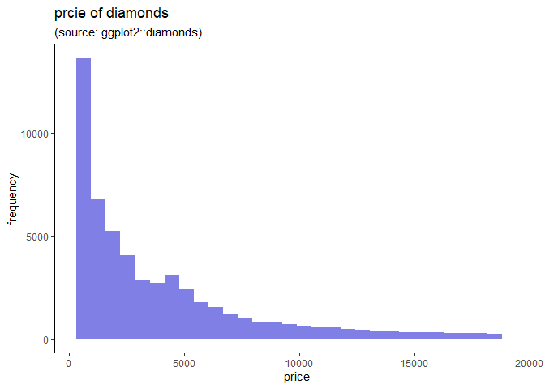
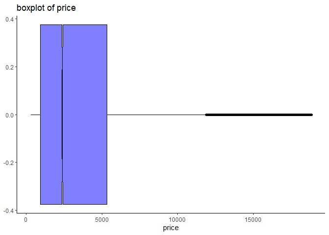
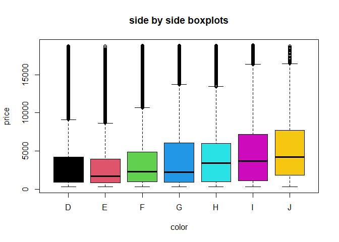
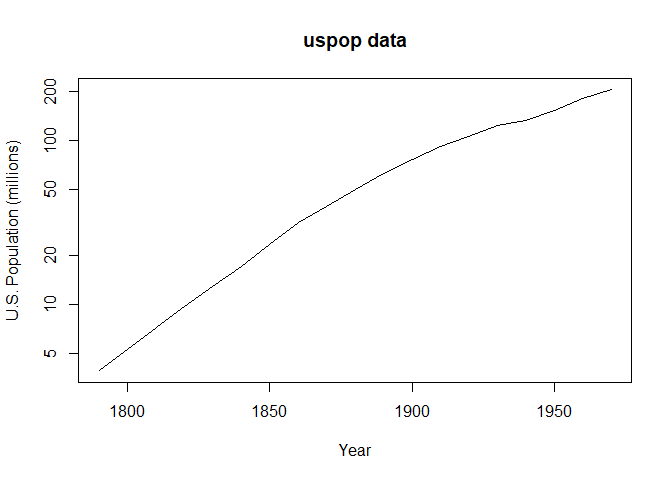
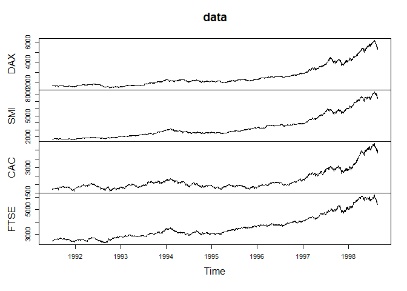
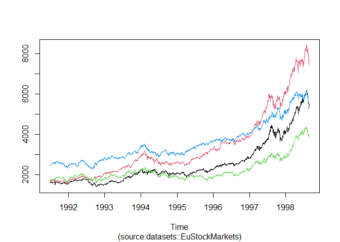

Data Visualization
================
Mwangi George
2022-10-14

### loading Packages

``` r
library(tidyverse)
```

    ## ── Attaching packages ─────────────────────────────────────── tidyverse 1.3.2 ──
    ## ✔ ggplot2 3.3.6      ✔ purrr   0.3.4 
    ## ✔ tibble  3.1.8      ✔ dplyr   1.0.10
    ## ✔ tidyr   1.2.0      ✔ stringr 1.4.1 
    ## ✔ readr   2.1.2      ✔ forcats 0.5.2 
    ## ── Conflicts ────────────────────────────────────────── tidyverse_conflicts() ──
    ## ✖ dplyr::filter() masks stats::filter()
    ## ✖ dplyr::lag()    masks stats::lag()

### Creating a barplot

``` r
diamonds %>%                                      # selects the data
  select(clarity) %>%                             # selects variable of interest
  table() %>%                                     # counts the various categories in the variable
  barplot(                                        # Creates a barplot
    main = "Clarity of diamonds",                 # Specifies the plot title
    sub = "(source:ggplot2::diamonds)",           # produces a sub title at the bottom of the graph
    horiz = T,                                    # Ensures the bars are horizontal
    ylab = "Clarity of diamonds",                 # y axis label
    xlab = "frequency",                           # X axis label
    xlim = c(0, 15000),                           # scale
    border = NA,                                  # no borders no on bars
    col = "blue3"                                 # fill the bars with blue color
  )
```

<!-- -->

### Creating side by side bar graphs

``` r
diamonds %>% 
  select(clarity, color) %>% 
  table() %>%  
  barplot(
    legend = rownames(.),
    beside =T,
    ylab = "frequency",
    xlab = "color",
    col = 1:8)
```

<!-- -->

### Creating Histograms

``` r
diamonds %>% 
  select(price) %>% 
  ggplot(aes(price)) +
  geom_histogram(
    fill = "blue3",
    alpha = 0.5)+
  labs(title = "prcie of diamonds",
       subtitle = "(source: ggplot2::diamonds)",
       y = "frequency")+
  theme_classic()
```

    ## `stat_bin()` using `bins = 30`. Pick better value with `binwidth`.

<!-- -->

### Creating boxplots

``` r
diamonds %>% 
  select(price) %>% 
  ggplot(aes(price))+
  geom_boxplot(fill = "blue", 
               alpha = 0.5,
               notch = T,
               col = "black")+
  labs(title = "boxplot of price")+
  theme_classic()
```

<!-- -->

``` r
diamonds %>% 
  select(color, price) %>% 
  boxplot(
    data =.,
    price~color,
    col = 1:8,
    main = "side by side boxplots",
    horiz = T
  )
```

<!-- -->

### Creating line charts

``` r
plot(uspop, log = "y", main = "uspop data", xlab = "Year",
     ylab = "U.S. Population (millions)")
```

<!-- -->

``` r
# use built in time series dataset
data <- EuStockMarkets

# plot the time series data
plot(data)
```

<!-- -->

``` r
# plot the lines on a single pane
ts.plot(data,
        col = 1:4,
        sub = "(source:datasets::EuStockMarkets)")
```

<!-- -->
