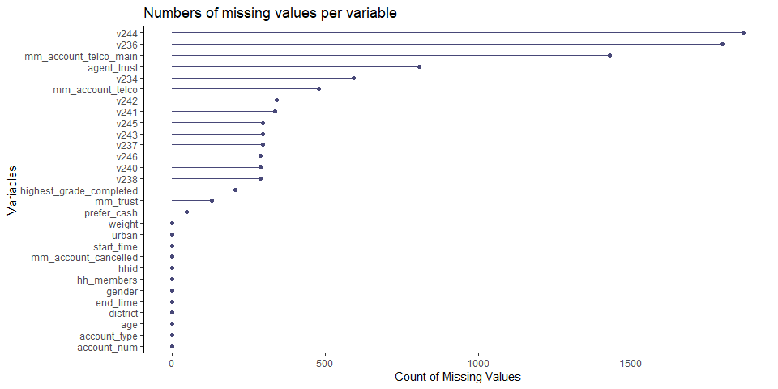
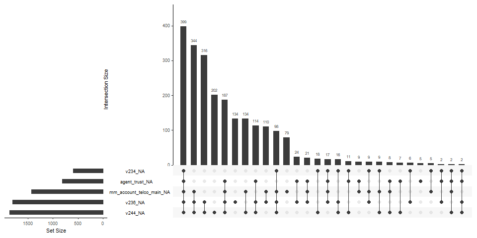

Dealing with Missing Data
================
Mwangi George
16 Nov, 2022

-   <a href="#introduction" id="toc-introduction">Introduction</a>
    -   <a href="#basic-functions" id="toc-basic-functions">Basic Functions</a>
    -   <a href="#advanced-functions" id="toc-advanced-functions">Advanced
        Functions</a>
-   <a href="#visualizing-missingness"
    id="toc-visualizing-missingness">Visualizing Missingness</a>

# Introduction

Missing data can undermine a study’s statistical power, provide skewed
estimates and produce false conclusions. In this paper, we are going to
look at what missing values are in R, how to find them, how to wrangle
and tidy missing data, explore why data is missing, and impute missing
values.

First, Missing values are values that should have been recorded but were
not. In R missing values are represented with `NA`, which stands for
`Not Available`. When starting any kind of analysis that involves the
use of data, it is important to be aware of missing values in your data
set. We are going to explore missing values using one of my favorite
packages in R, `naniar`. This package provides all the functionalities
you need to find, explore, wrangle, visualize and impute missing values.
Alright, let’s get started by first read the data into R.

``` r
# load packages
pacman::p_load(tidyverse, naniar, visdat, ggthemes)
# laod dataset
my_data <- read_csv("mobile_money_data.csv",
  show_col_types = F
)

# print the number of rows and columns in the dataset
dim(my_data)
```

    ## [1] 2442   29

``` r
# print variable names
names(my_data)
```

    ##  [1] "start_time"              "end_time"               
    ##  [3] "hhid"                    "account_num"            
    ##  [5] "account_type"            "weight"                 
    ##  [7] "district"                "urban"                  
    ##  [9] "gender"                  "age"                    
    ## [11] "hh_members"              "highest_grade_completed"
    ## [13] "mm_account_cancelled"    "prefer_cash"            
    ## [15] "mm_trust"                "mm_account_telco"       
    ## [17] "mm_account_telco_main"   "v234"                   
    ## [19] "agent_trust"             "v236"                   
    ## [21] "v237"                    "v238"                   
    ## [23] "v240"                    "v241"                   
    ## [25] "v242"                    "v243"                   
    ## [27] "v244"                    "v245"                   
    ## [29] "v246"

## Basic Functions

The data contain 29 variables and 2442 rows. The function `any_na` from
`naniar` package allows for investigating the existence of missing data
in the dataframe. It can take a dataframe or a vector.

``` r
# are there NA's in the data
any_na(my_data)
```

    ## [1] TRUE

The function `are_na` does the same thing but returns a logical vector
for each element. This functions, however, does not take a dataframe as
an argument. O

``` r
head(are_na(my_data$mm_trust))
```

    ## [1] FALSE FALSE FALSE FALSE FALSE FALSE

The above output shows that the first six observations in the `mm_trust`
variable are not NA’s. If we want to count the overall number of missing
values in the data frame, we can call `n_miss()` on the dataframe

``` r
# count of missingness in the data
n_miss(my_data)
```

    ## [1] 9785

To know the proportion of missing data in the table, we call
`prop_miss()`

``` r
# proportion of missing data
prop_miss(my_data)
```

    ## [1] 0.1381711

We can see that 0.1382 of the data is missing. The opposite of
`prop_miss()` is `prop_complete()`.

``` r
# proportion of complete data
prop_complete(my_data)
```

    ## [1] 0.8618289

To achieve the same results, we can call `pct_miss()` and
`pct_complete()` to calculate the percentage of missing and complete
data respectively.

``` r
# percentage of missing data
pct_miss(my_data)
```

    ## [1] 13.81711

## Advanced Functions

Lets now scale up to powerful functions for handling missing data. One
thing I love about the `naniar` package is that its wrangling functions
return a dataframe. Additionally these function work well with dplyr’s
functions for data manipulation. Let’s with `miss_var_summary()`.
Calling this function on the data returns a dataframe with each
variable, the number of missing observations in the variable, and
percentage of missingness in that variable. Additionally, the function
arranges the results in descending order of missingness.

``` r
miss_var_summary(my_data) %>% 
  head()
```

    ## # A tibble: 6 × 3
    ##   variable              n_miss pct_miss
    ##   <chr>                  <int>    <dbl>
    ## 1 v244                    1867     76.5
    ## 2 v236                    1799     73.7
    ## 3 mm_account_telco_main   1431     58.6
    ## 4 agent_trust              808     33.1
    ## 5 v234                     594     24.3
    ## 6 mm_account_telco         478     19.6

From the output above, we can see that the variable `v244` had the most
NA’s followed by `v236` and so on. I can bet I was the happiest person
when I first learned this.

Next, is `miss_case_summary()` which returns missingness statistics at
observational level i.e for each row.

``` r
miss_case_summary(my_data) %>% 
  head()
```

    ## # A tibble: 6 × 3
    ##    case n_miss pct_miss
    ##   <int>  <int>    <dbl>
    ## 1   347     17     58.6
    ## 2   549     17     58.6
    ## 3  2218     17     58.6
    ## 4    38     16     55.2
    ## 5   133     16     55.2
    ## 6   276     16     55.2

We can deduce that row 347 had the most NA’s followed by row 549 and so
on. Another function is `miss_var_table()` which returns variable-wise
statistics for missing data.

``` r
miss_var_table(my_data) %>% 
  head()
```

    ## # A tibble: 6 × 3
    ##   n_miss_in_var n_vars pct_vars
    ##           <int>  <int>    <dbl>
    ## 1             0     12    41.4 
    ## 2            47      1     3.45
    ## 3           128      1     3.45
    ## 4           207      1     3.45
    ## 5           287      3    10.3 
    ## 6           296      3    10.3

From the output we can learn that there are 12 variables with no missing
values in the dataset. This accounts for about 41% of all the variables
in the dataset. `miss_case_table()` does the same this but at
observational level.

``` r
miss_case_table(my_data) %>% 
  head()
```

    ## # A tibble: 6 × 3
    ##   n_miss_in_case n_cases pct_cases
    ##            <int>   <int>     <dbl>
    ## 1              0     147      6.02
    ## 2              1     399     16.3 
    ## 3              2     614     25.1 
    ## 4              3     489     20.0 
    ## 5              4     232      9.50
    ## 6              5     123      5.04

We can learn that there are 147 cases or rows in the dataframe with no
missing values, 399 rows with 1 missing value, and so on.

Our next function is `miss_var_span()`. This function is quite helpful
to identify missingness in a dataset over a given span or run. For
someone who works with time series data, this function can be a life
saver. The syntax of the function is as follows:
`miss_var_span(data, var, span_every)` where var is the variable of
interest, and span_every is the number of spans or runs. Say we want to
explore missingness in the variable `v244` for a span of every 500
observations.

``` r
miss_var_span(data = my_data, var = v244, span_every = 500)
```

    ## # A tibble: 5 × 6
    ##   span_counter n_miss n_complete prop_miss prop_complete n_in_span
    ##          <int>  <int>      <int>     <dbl>         <dbl>     <int>
    ## 1            1    389        111     0.778         0.222       500
    ## 2            2    394        106     0.788         0.212       500
    ## 3            3    387        113     0.774         0.226       500
    ## 4            4    372        128     0.744         0.256       500
    ## 5            5    325        117     0.735         0.265       442

We can see that for the first 500 observations in the variable `v244`,
there are 389 missing values. The function provides other helpful
statistics for very span.

# Visualizing Missingness

The `visdat` comes in handy if we want to visualize missing values by
variable. Simply calling `vis_miss()` on the data create a nice visual
showing percentage of missing values in variable. The color black
represent missing values and grey represents complete data.

``` r
vis_miss(my_data)
```

    ## Warning: `gather_()` was deprecated in tidyr 1.2.0.
    ## ℹ Please use `gather()` instead.
    ## ℹ The deprecated feature was likely used in the visdat package.
    ##   Please report the issue at <https://github.com/ropensci/visdat/issues>.

<!-- -->

The `vis_miss()` functions also allows for additional arguments such as
`cluster` to identify common co-occurrences and `sort_miss` to arrange
columns.

To quickly visualize missingness in the variables and cases, can call
`gg_miss_var()` and `gg_miss_case()` on the data.

``` r
# visualize missingness per variable
gg_miss_var(my_data) +
  # add labels
  labs(
    title = "Numbers of missing values per variable",
    y = "Count of Missing Values"
  ) +
  # make axis text bold
  theme(axis.text.y = element_text(face = "bold"))+
  # add theme
  theme_classic()
```

<!-- -->

Again, the variable `v244` contains the most missing values followed by
`v236`, and `mm_account_telco_main`.

``` r
# visualize missingness in each case
gg_miss_case(my_data)+
  labs(title = "Missingness per case")
```

<!-- -->

To visualize common combinations of missingness, i.e which variables and
case go missing together, we can call `gg_miss_upset()`

``` r
gg_miss_upset(my_data)
```

<!-- -->

We can see that only 399 missing value combinations of v244, v236,
mm_account_telco_main, agent_trust, and v234. There are only 344 of
v244, v236 and mm_account_telco_main.

To explore how missingness in each variable changes across a factor say,
gender in this case, we call `gg_miss_fct()`. This displays a heat-map
visualization showing the factor on the x axis, each other variable on
the y axis, and the amount of missingness colored from dark, purple to
blue.

``` r
  gg_miss_fct(my_data, fct = gender) +
  labs(
    title = "Percentage of Missing values across Gender"
    )+
  theme_calc()
```

<!-- -->

Depending on the intensity of the colors, most values are missing in the
female category.

To visualize missingness over a span or run, we can use `gg_miss_span()`
and pass the data, the variable of interest, and the size of every span.

``` r
gg_miss_span(my_data, agent_trust, 500)+ 
  theme_calc()
```

<!-- -->

We can learn that most of the data is missing in the third span, i.e
from case 1001 to case 1500.
